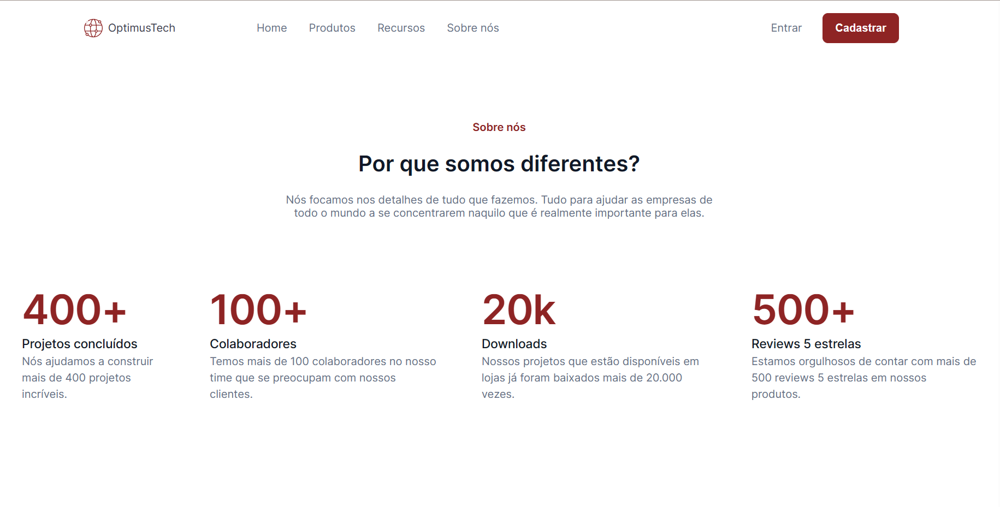

<h1 align="center"> 7DaysOfCode HTML e CSS </h1>

Programa exclusivo e gratuito, promovido pela Alura para prática de programação.  

  <a href="#-tecnologias">Tecnologias</a>&nbsp;&nbsp;&nbsp;|&nbsp;&nbsp;&nbsp;
  <a href="#-projeto">Projeto</a>&nbsp;&nbsp;&nbsp;

 

  

## 🚀 Tecnologias

Esse projeto foi desenvolvido com as seguintes tecnologias:

- Figma
- HTML e CSS
- Git e Github

## 💻 Projeto

O objetivo do projeto foi o desenvolvimento de uma Landing Page de vagas de trabalho utilizando apenas HTML e CSS.

